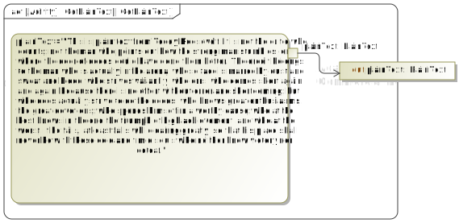

# MSOSA Cryptography Examples
THe Magic Model Analyst in MSOSA is a helpful tool to visualize behavioral diagrams in CATIA Magic Systems of Systems Architect used for Model-Based Systems Engineering (MBSE). The simulaiton tool also is flexible enough to enable modelers to call external programs and write custom code in different languages, one of which is Python. However, the Python deployment as of MSOSA 2024 is version 2, which does not support the bytes and bytearray data types. This means libaries that depend on these data types are not available within MSOSA, like the library documented at https://crytpography.io.

For this repository and examples, the goal is to simulate some basic cryptographic recipies to demonstrate the system design in simulated SysML activity diagrams. Since we want to use Python3 for the examples, we must also craft external command line scripts to call with opaque actions in the nested activity diagrams. This is a useful feature, so the package containing the RunCommand activity diagram is available in this repository at [CallingExternalFunctions](https://github.com/SystemsCyber/MBSE/tree/main/CallingExternalFunctions).

This directory should contain the following
 * .MDZIP files, which are the native file for MSOSA.
 * .py files, which are the external helper functions.
 * Screenshots and diagram images to show the procedure.
 * README.md (this file) that has examples from the files.
 
## Setting up the Model
For this minimal example, we'll setup a Systems Context and establish Use Cases. From the Use Cases, we'll call an activity diagram to model the use cases. 

The external functions should be commandline interfaces and use the argument parser to process inputs from the a command line interface (CLI). In this case, input arguments must not contain new line or carriage return characters and be input as ASCII, so most data is passed into the functions as base64 encoded command line arguments. Therefore, most python files in this directory will use argparse to separate the various inputs. Also, the outputs are likely base64 encoded strings pushed to the standard output (stdout). If more complex inputs are needed, then file saving and reading can be used. 

Since binary data is needed for cryptographic material, we'll encode the data using base64. 

### Example: Alice wants to send and encrypted message to Bob
This example uses symmetric encryption (AES-128 in CFB mode) to exchange private messages. The actors, Alice and Bob, have a shared secret password. This password is not a very good password, but it can be used for an elementary example. Passwords and password security is a challenge in modern distributed computing. Using a password manager to use complex, unique, and long passwords is the minimum standard of care these days.

### System Context
The examples and files in this directory have a system context modeled as a SysML block definition diagram (bdd) to how the different concepts in cryptography. This heirarch was inspired by Chapter 5 in Ross Anderson's Security Engineering text: https://www.cl.cam.ac.uk/archive/rja14/book.html. The bdd to show context is as follows:


In this model, the values used in the cryptographic operations are passed between actions and activities as strings, becasue they are binary blobs encoded as base64 strings. Practical implementations outside MSOSA will treat these as bytes in Python.


### Use Cases
The use case diagram show Alice encrypting a message and Bob decrypting the message with the context to be Symmetric Encryption.


The rake symbol in the Encrypt Message use case means there is an embedded activity diagram that models the use case.

### Activity Diagram

The high level activity diagram for the Encrypt Message use case is as follows.


Each of these actions call embedded actions (as seen with the rake symbol). They all call external functions, so the embedded activity diagrams mainly use opaque actions to setup the argument to call external functions. The following images show the five embedded activity diagrams from the Encrypt Message namespace.

#### Password
The RequestPassword activity diagram is as simplistic as possible. There is a hard-coded password assigned to the output pin of an opaque action. This simple syntax is valid in most computer languages. A system should never use hardcoded passwords, but the example is predicates on the tow parties knowing the same password, which is may not be the best system design. 


#### Key Derivation
The DeriveKey activity diagram sets up the RunCommand behavior that was imported from a different project as a read-only package. Since the RunCommand has two arguments as inputs (script name and arguments), those need to be defined. In this case, the script to call is [deriveKey.py](deriveKey.py). The outputs are stdout, stderr, and a numerical return code. When the function works as expected, only the stdout is used. The other outputs can be used for debugging by looking at their contetns in the MSOSA simulation console.


The deriveKey.py script uses a salt to add entropy to the hash and create a salted derived key. This means the password and the salt value will be needed to recreate the symmetric 16-byte key. This is saved as the binary file called [salt.bin](salt.bin).

#### Plain Text
The plain text input for this example is defined similarly to the password. The example is a snippet from Teddy Roosevelt's famous man in the arena speech.
```
This is plain text from Teddy Roosevelt: It is not the critic who counts; not the man who points out how the strong man stumbles, or where the doer of deeds could have done them better. The credit belongs to the man who is actually in the arena, whose face is marred by dust and sweat and blood; who strives valiantly; who errs, who comes short again and again, because there is no effort without error and shortcoming; but who does actually strive to do the deeds; who knows great enthusiasms, the great devotions; who spends himself in a worthy cause; who at the best knows in the end the triumph of high achievement, and who at the worst, if he fails, at least fails while daring greatly, so that his place shall never be with those cold and timid souls who neither know victory nor defeat.
```



The activity of collecting the plain text from the user or subsystem is beyond the scope of this example. Therefore, we chose to "hard-code" the plain text, much like we did for the password. Practical systems will have some sort of plain text gathering and processing functions. Also, plain text does not have to be human readable information, it's simply a term used in cryptography for the data that gets protected.

#### Encipher the Data
The CreateCipherText activity diagram shows how the plain text is encoded as base64 to be used as one of the arguments. The other argument is the symmetric key that was already encoded as base64. The script [createCipherText.py](createCipherText.py) is the core logic of this example. It uses the AES cipher in CFB mode using 128-bit blocks. The documentation for this is available at https://cryptography.io/en/latest/hazmat/primitives/symmetric-encryption/.


Since the script takes two arguments, the opaque action in python of `outputValue = '"{}" "{}"'.format(key,encodedPlainText)` is able to combine two inputs into a string with each input encapuslated in quotes. 

The output is the cipher text and the initialization vector in a dotted base64 string. The base64-encoded cipher text is first followed by the base64-encoded initialization vector: `ciphertext.iv`. This format enables the result to be on a single line, since it is transfered to another function as a command line argument.

#### Save the CipherText
Finally, the example saves the output in a javascript object notation (JSON) format. Since the data has already been encoded as base64, the json is straight forward. An example of the json output may appear as follows:
```
{
    "ciphertext": "VK9qdDvxuyOhDVg/K3uWo/p8X71ChyyXikSjjIdMd2bUYA==", 
    "iv": "X22hvN7/n8RrHpat4+xOVQ=="
}
```
Note: to reverse this process and recover the plain text message, four data are needed:
1. Cipher Text
2. Initialization Vector
3. Password
4. Key Derivation Function Salt

#### RunCommmand
The utility to run external commands is saved in a separate file and importable as a package. The activity diagram for RunCommand is as follows:


## Summary
This example gives a demonstration on how to generate authentic cryptographic artifacts for use in CATIA MSOSA behavior modeling and simulation. Including these external functions capable of cryptographic operations ensures the activities are properly modeled and the sequence of actions is realistic. 